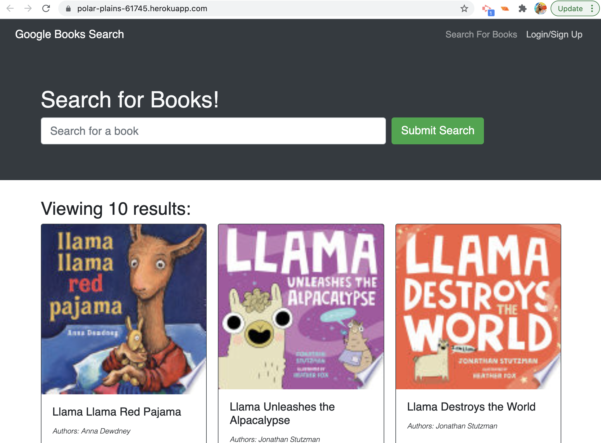
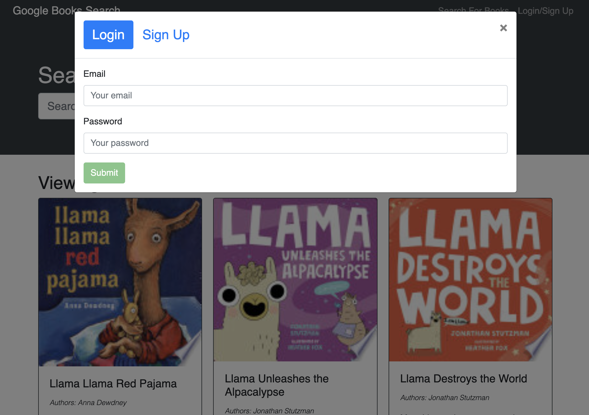
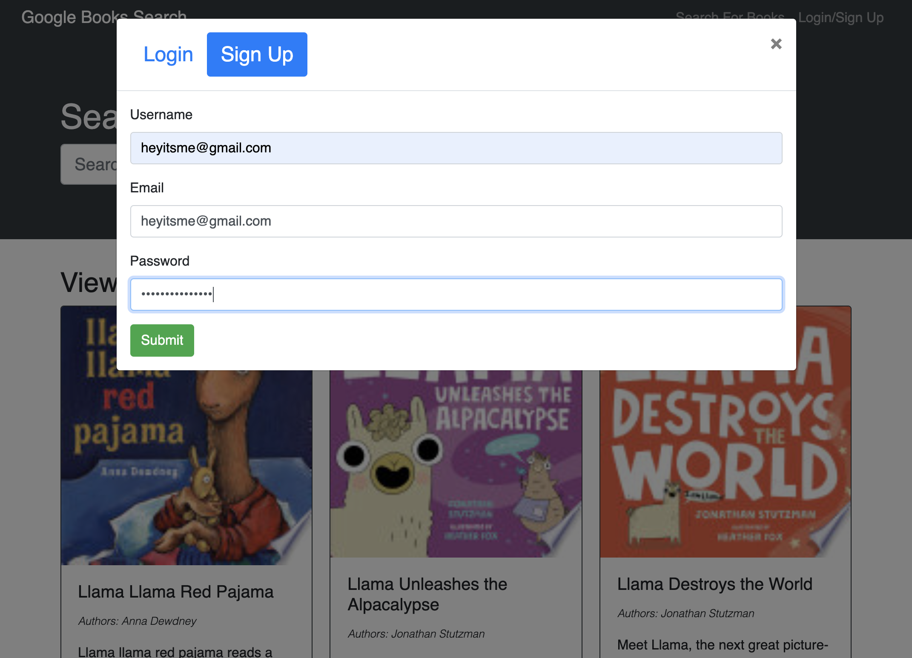

# BookSearch3

A Google Books API search engine built with a RESTful API. The app was built using the MERN stack with a React front end, MongoDB database, and Node.js/Express.js server and API.

## Goal:

Re-factor existing code to use GraphQLqueries and mutations to fetch and modify data.

## Issues:

Took multiples tries in order to get a repo to deploy correctly on Heroku. Attempt 3 finally suceeded. I discovered that I was missing my Config Vars in Heroku amongst other problems. All commits are in my first and second repo.

## Results:

I was able to successfully deploy, use hooks and graphQL and search for books.

### HOME:

### LOGIN:

### SIGNUP:

### Github Link:

https://sbgastondesign.github.io/BookSearch3/

### Heroku Link:

https://polar-plains-61745.herokuapp.com/

### License

MIT License, Copyright (c) [2021] [StephanieGaston]

---

### Contact:

- Email: sbgastondesign@gmail.com
- Github: github.com/sbgastondesign
- LinkedIn: "http://www.linkedin.com/stephanie-gaston-1067217a/"
